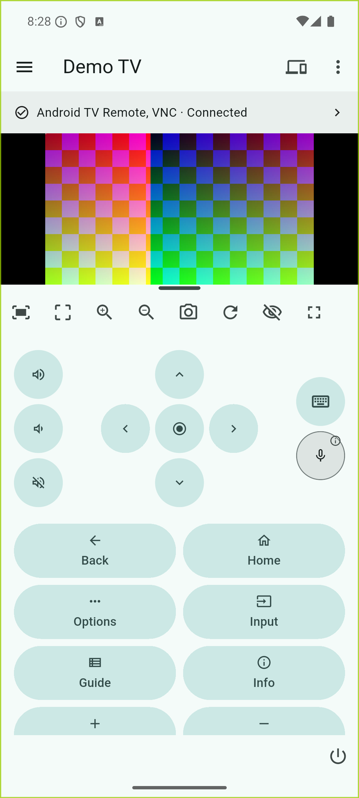
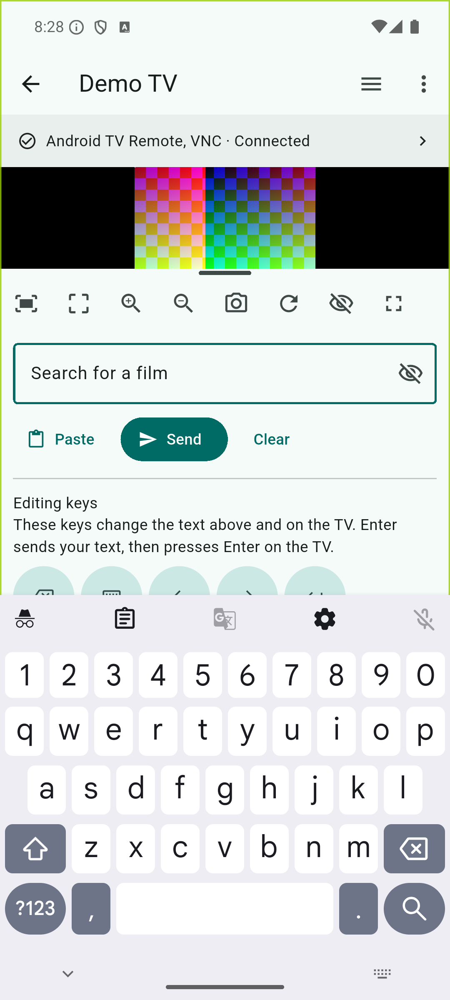
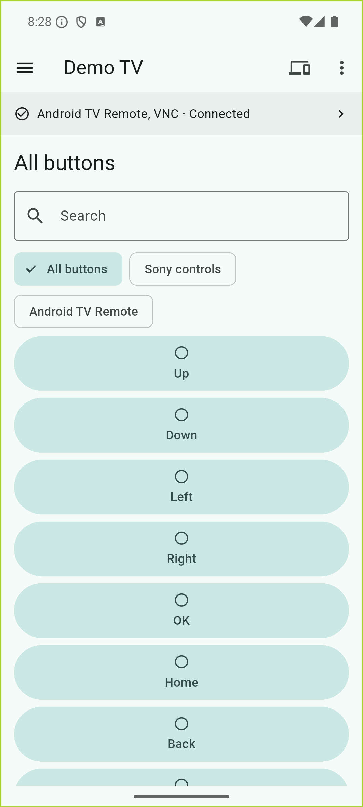

# TV VNC

TV VNC turns an Android phone or tablet into a viewer and remote control for an
Android TV on the same network: see the screen the TV shares, press familiar
remote buttons, and type with your phone or tablet keyboard. Some Sony TVs also
provide their own remote commands, input lists and status information.

> **Development preview — Phase 0, local network only.** There is no public
> release yet. Features depend on the TV and its services, and compatibility
> testing is still in progress. This phase does not cover built-in VPN setup or
> testing from another location. [Release progress](https://github.com/amersheeny/tvvnc/issues/1).

## Why TV VNC?

Talking someone through a television over the phone turns into a guessing game:
which input is selected, what is highlighted, what happened after that last
button press? TV VNC is being built so the person helping can see the TV and
press the buttons themselves, instead of describing them. For now that means
being on the same network as the TV.

It is for the times someone else needs a hand with their TV — a parent, an older
relative, a friend — and describing a menu over the phone is not working. Anyone
can get lost in a TV settings menu; the point is to make help easier to give.
This is a TV-support project, not a remote PC administration tool. Use it only
with the TV owner's knowledge and permission.

The design is **a remote with a view**. VNC supplies the picture while native TV
protocols supply remote controls. These connections are independent: controls
can remain available when screen sharing is unavailable.

## Screenshots

These are screenshots of the actual Android app connected to a local test
service, not to a physical TV. The coloured preview is a test pattern. They show
what the app looks like, not which TVs it works with.

  
  
  

- **Remote:** familiar controls beside the screen preview.
- **Keyboard:** the text already in the TV's field arrives on your phone; edit it there and the changes appear as you type — when the TV shares that field.
- **All buttons:** search or filter the command list, including standard navigation buttons.

Select an image to view it at full size. [Screenshot provenance](docs/images/README.md).

## Capabilities

These features are implemented; their availability and behaviour depend on the
TV, the current app/input, permissions and connected services.

- **Physical-style remote:** D-pad and OK, Back, Home, Options, Input, Guide, Info, volume/mute, channel and media controls. Real key-down/key-up holds where the transport supports them.
- **Extra buttons:** Searchable **All buttons**, including Sony-reported IRCC commands such as number, colour, subtitle/audio and HDMI-CEC controls when supplied by the TV; Android key-code entry is also available.
- **Screen viewer:** Live VNC preview, portrait/landscape and fullscreen, pinch zoom/pan, fit and 1:1 views, local screenshots, reconnect, and a thin draggable preview-height handle. The viewer can be hidden while controls remain available.
- **Navigation modes:** Remote, Touchpad and Direct touch, selected from the remote's three-dot menu. Direct touch maps the displayed picture to framebuffer coordinates.
- **Keyboard:** Automatic native editor prefill, live typing/deletion, cursor changes and paste when Android TV Remote supplies the editor. Search/Done and TV-defined actions follow its metadata. A local text draft is available when live editing is unavailable.
- **Inputs and apps:** Detected source names/labels and direct switching where exposed; available app listings/icons, launch, deep links, favourites and recents. No assumption that a particular streaming app is installed.
- **Personalisation:** Saved TVs, reordered remote controls and local **Shortcuts** made from semantic actions such as Wake, wait for TV, Home, input and app launch.
- **Voice:** Hold-to-talk streaming when the authenticated Android TV Remote service negotiates voice support. Microphone permission is requested when needed; hardware acceptance is still pending.
- **Power and recovery:** Capability-based TV power commands and Wake-on-LAN, observed-state wake progress and independent transport reconnects. Standby/network settings determine whether a TV can be woken; successful standby wake is not yet established on the reference TV.
- **Status and diagnostics:** Available power/input/app/volume/mute state, transport status, capability refresh, connection tests and a diagnostic report that excludes secrets, editor text and screen pixels.

An unavailable button is not proof that the TV can never support it: a service
may need pairing, permission or reconnection. Nor does sending a command prove
the television performed it. Commands with uncertain delivery are not blindly
replayed through another transport.

## How it works

The Flutter interface expresses TV operations; a native capability router
chooses an available implementation. Routing does not live in individual buttons.

| Component | Main responsibility |
| --- | --- |
| Android TV Remote v2 | TLS pairing, native keys and holds, focused-editor text, app/deep-link launch, state and negotiated voice. |
| Sony BRAVIA REST / IRCC-IP | TV-reported remote commands, available inputs/apps and vendor state/control APIs, subject to authentication and model support. |
| RFB / LibVNCClient | The screen and pointer, with keyboard/text fallbacks. Native decoding runs outside Flutter's UI thread. |
| Wake-on-LAN | A wake attempt using the saved network MAC where the TV and network support it; not a guarantee of power-on. |

Sony commands are discovered from the TV's own remote-control catalogue rather
than relying only on hardcoded IRCC codes. VNC credentials, Android Remote
pairing and Sony authentication are **separate**. Seeing a VNC picture does not
mean native remote pairing has happened.

ADB is not needed for everyday use. Phase 0 includes neither an integrated VPN
engine nor a TV companion APK. Future private-network access is not restricted
to OpenVPN; no OpenVPN, WireGuard or other profile importer is implemented here.

## Requirements and setup

TV VNC runs on an **Android phone or tablet, Android 8.0 / API 26 or newer**.
The reference television is a **Sony KD-55AF8 running Android 9**; it is a test
target, not a hardcoded device restriction or a claim that all Android TVs work.

Initial setup can require someone at the TV to grant permissions and read
pairing codes.

1. **Connect both devices to a trusted local network.** Allow local-network
   access on the controller if Android requests it. Use **Find TVs**, or
   **Enter address** with the TV's private IP/local hostname. Ports have their
   own fields under Settings.
2. **Enable screen sharing on the TV.** Use an existing
   [droidVNC-NG](https://github.com/bk138/droidVNC-NG) installation or another
   compatible RFB server. Start capture and grant the required TV-side screen
   sharing permissions. For droidVNC-NG input/pointer control, enable its
   Accessibility service. Enter its VNC port and password in the saved TV.
3. **Pair native controls separately.** Select **Pair with your TV** and enter
   the code displayed by Android TV Remote Service. Pairing is saved securely.
   An open service port alone is not treated as proof of v2 capability.
4. **Enable Sony controls if available.** Configure the TV's IP-control
   authentication, then supply its pre-shared key or use the app's explicit
   Sony PIN registration flow. Available commands, inputs and apps come from
   the TV.
5. **Configure wake only if supported.** Save the TV's Wi-Fi/Ethernet MAC, not a
   Bluetooth MAC. Check its Remote start/network standby settings, and test
   waking it before relying on unattended support.

For Direct touch, first check that a tap matches the intended location on the
TV. Two-finger pan/zoom changes the local view. Sony IRCC-only commands are not
presented as genuine key holds.

## Using the keyboard

Focus a text field on the TV, then open **Keyboard** in TV VNC. When the native
service supplies that editor, its existing text appears automatically and edits
are sent as you type — **Send is not required for live mirroring**. Backspace,
cursor movement and paste operate on that bound editor.

Normally, **Send** transmits the current text without pressing Enter. Use it to
send a local draft when live editing is unavailable. When a live TV field defines
a custom action, that in-page button instead performs the action after sending
pending text. It shows the TV's action label, or keeps **Send** if the label is
blank. The custom label does not appear on the phone keyboard's own key.

The phone's action key follows the TV's standard Search/Done/Next metadata and
sends pending text before invoking the corresponding TV action. If focus
changes or delivery is uncertain, the app keeps the draft and asks you to load
the TV's text or confirm replacement instead of silently writing into a
different field. The top-left back arrow leaves the phone's Keyboard page; it
is distinct from pressing Back on the TV.

VNC alone does not provide the same native editor synchronisation. When no
native field is available, a draft stays local until sent using an available
text transport. Copying text to the TV clipboard and asking the TV to paste are
separate operations; a socket write is not an insertion acknowledgement.

TV-declared password fields start masked. Text marked private stays protected
after reveal, is excluded from the ordinary draft cache and TV clipboard, and
has keyboard suggestions/learning disabled. Protected local text clears when
leaving its context or backgrounding; it may be fetched and masked again when
returning to the same TV field. Ordinary drafts are kept only in memory, by
TV/application, not written to persistent storage.

## Privacy and limitations

- **Owner permission:** get permission from the TV owner before using TV VNC.
  The app does not add an owner-approval prompt for each later command. Pairing
  and screen-sharing permissions are separate checks for access to the device.
- **Private connections, no relay:** no advertising, analytics or cloud telemetry
  in the app. Do not expose VNC or Sony control ports to the public internet.
- **Not every local protocol is encrypted:** Android Remote uses pinned TLS
  certificates. Classic VNC screen traffic and Sony HTTP are not encrypted.
  Classic VNC authentication uses only the first eight password bytes.
- **Local credentials:** saved profiles and secrets are encrypted using Android
  Keystore-backed storage; backup/device-transfer exclusions cover private app
  storage. Diagnostic exports omit passwords, cookies, pairing codes/private
  keys, editor contents and framebuffer pixels.
- **Explicit exports:** screenshots are saved on the controller. Its separate
  gallery/backup settings may copy exported images elsewhere.
- **Voice is not an offline-assistant promise:** TV VNC does not save microphone
  audio; the TV's existing assistant may use its own online services.
- **Capture has limits:** protected/DRM content can be black. Black pixels alone
  do not identify DRM or a stalled stream. HDMI capture varies by TV and has
  not been established on the reference device. No protection is bypassed.
- **Foreground operation:** backgrounding stops input and closes sessions;
  returning reconnects an intended active session. Explicit Disconnect pauses
  retries; it is not a TV power command. Power commands target the TV.
- **Physical failures remain physical:** an unplugged TV, offline router, lost
  network link or firmware frozen before networking cannot be repaired by this
  app alone. No smart-plug/hard-power-cycle integration is included.

## Project status

This is active development, not a universal replacement for every physical
remote. An earlier build was exercised on the reference Sony with screen
viewing, native pairing/navigation, live search-field typing/backspace and
volume/mute. Newer keyboard edge cases have additional emulator/protocol tests;
that is not equivalent to repeating them on the physical TV.

Voice, standby wake, HDMI capture, broad device compatibility and the full
recovery/performance matrix still need real-device evidence.
[Release progress](https://github.com/amersheeny/tvvnc/issues/1) tracks publishing
the source/dependency forks, release signing, further validation and Play submission.

## Development and contributing

Start with the [development notes](docs/development.md). **Fresh-clone builds
are not ready yet:** two native submodule URLs still refer to development-only
local repositories. Public fork publication must be completed first.

Useful contributions include reproducible compatibility reports, native
protocol tests, accessibility checks and safer recovery behaviour. Include the
TV/controller models, OS and service versions, the action attempted and which
transports were connected. Remove credentials, pairing codes and personal
screen contents from reports. Please do not attach real passwords or private keys.

## License and acknowledgements

TV VNC is **GPL-3.0-or-later**. See [LICENSE](LICENSE) and the dependency and
modification notices in [NOTICE](NOTICE).

The app builds on [LibVNCClient / LibVNCServer](https://github.com/LibVNC/libvncserver),
[libjpeg-turbo](https://github.com/libjpeg-turbo/libjpeg-turbo),
a maintained Android Remote library derived from
[ScreenCast](https://github.com/ddagunts/ScreenCast), and protocol schemas from
[androidtvremote2](https://github.com/tronikos/androidtvremote2).
[droidVNC-NG](https://github.com/bk138/droidVNC-NG) is a TV-side server used for
screen sharing, not a bundled component or the application's only control path.
